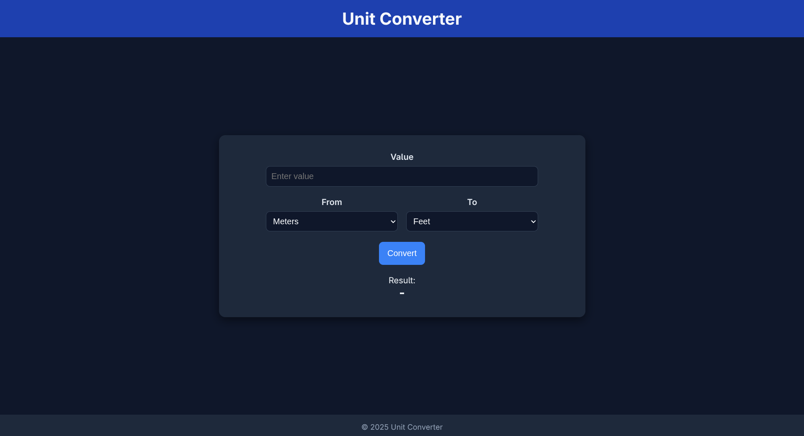

# Unit Converter

A simple, responsive **Unit Converter** web application built with HTML, CSS, and JavaScript. Convert between common distance units like meters, feet, kilometers, and miles in a clean, modern interface.

---

## Features

- Convert between **meters, feet, kilometers, and miles**.
- Real-time conversion with a button click or pressing **Enter**.
- Responsive design that works on **desktop, tablet, and mobile**.
- Clean UI with a modern dark theme.
- Accessible form elements with proper labels.

---

## Demo

  

---

## Installation

1. Clone the repository:

```bash
git clone https://github.com/JANS66/unit-converter.git

